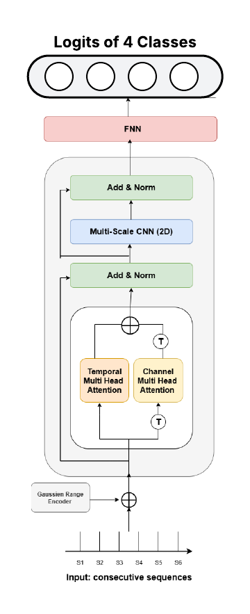

# **Emotion Detection from Keystroke Dynamics**

Developed a deep learning model to detect emotions based on typing behavior, leveraging keystroke dynamics.

---

## **Project Overview**

- Analyzed **keystroke dynamics data** to identify feature differences across emotions.  
- Implemented a **dual-attention Transformer model** capturing both timing and channel dependencies in typing patterns.  
- Validated the model for accurate emotion recognition, achieving **85% accuracy**.

---

## **Key Features**

- **Dual-Attention Transformer:** Simultaneously models temporal patterns (timing) and multi-channel keystroke data.  
- **Emotion Classification:** Predicts emotional states such as happiness, sadness, anger, etc., based on typing behavior.  
- **Data-Driven Insights:** Identifies keystroke features that correlate strongly with different emotional states.

---

## **Model architecture**

